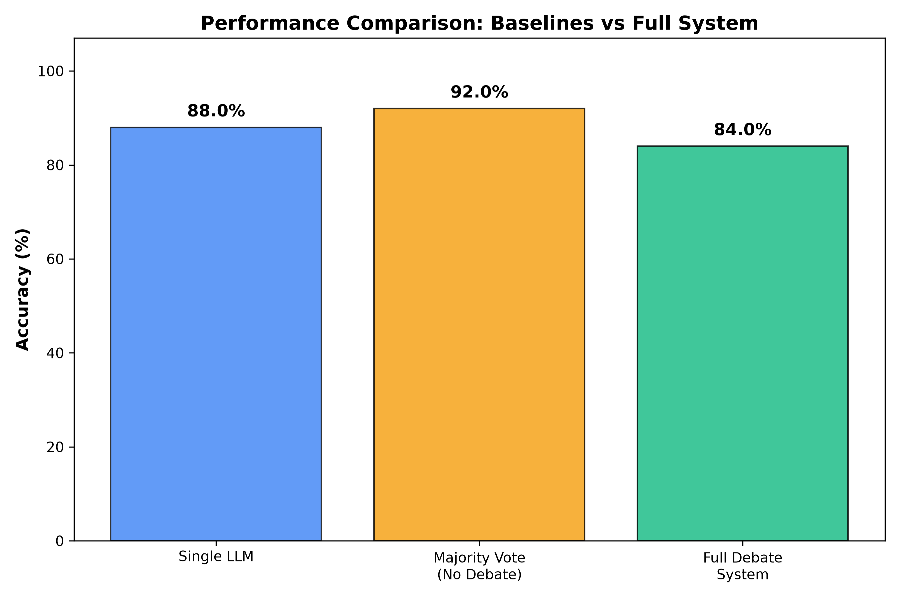
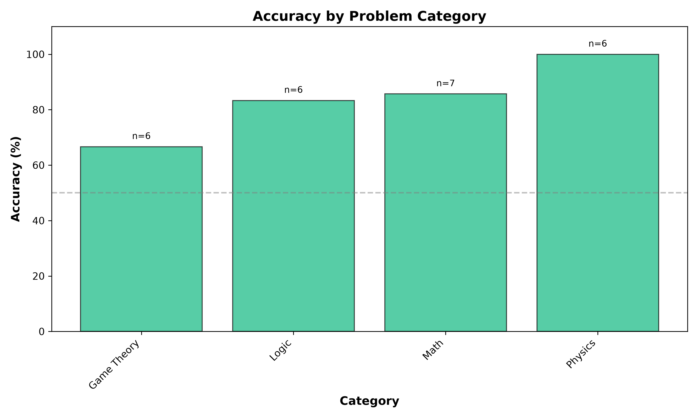
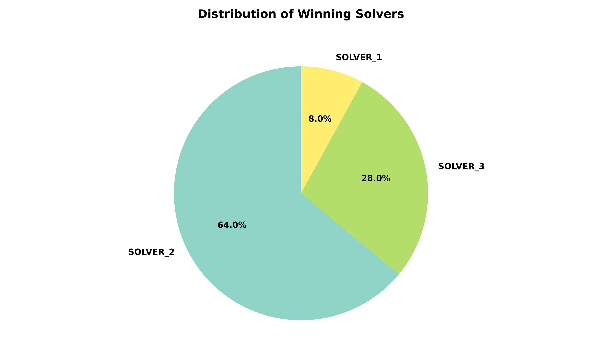

# Gemini Multi-Agent Debate System

This repository explores how multiple LLM agents backed by Google Gemini can collaborate on challenging math and logic tasks. Rather than querying a single model, the agents debate each other, review competing answers, and arrive at a judged consensus.

## Project Aims
* **Self-Selection:** Agents assess each problem and determine who is best suited to act as Judge and who should serve as Solvers.
* **Structured Reasoning:** Outputs are formatted using strict JSON schemas with Pydantic so the data remains consistent and machine-readable.
* **Debate & Refinement:** Solvers offer answers, peer reviewers critique them, and then solutions are refined before the final decision.
* **Accuracy Tracking:** Scripts automate multiple problem runs and generate plots to track performance.

---

## System Architecture

### Roles
The framework assigns **four distinct roles** to agents:

* **Three Solver Roles** with different personas:
  - **First-Principles Thinker:** Decomposes problems into fundamental steps and builds answers from the bottom up.
  - **Skeptical Critic:** Probes for hidden assumptions, edge cases, and calculation mistakes.
  - **Creative Strategist:** Searches for elegant shortcuts, patterns, or alternative solutions while remaining rigorous.

* **One Judge:** Reviews the final candidate answers and selects the strongest response.

### Five-Stage Debate Process

**Stage 0: Self-Assessment and Role Assignment**
- Each agent evaluates whether it is more suited to judging or solving the current problem.
- The agent with the highest judge confidence becomes the Judge.
- The remaining agents become Solvers and are ordered by solver confidence.

**Stage 1: Independent Solution Generation**
- Each Solver independently crafts a solution based on its persona.
- Solvers do not exchange information during this stage.

**Stage 2: Peer Review**
- Each Solver examines the other two solutions critically.
- Reviews point out strengths, weaknesses, mistakes, and possible improvements.

**Stage 3: Solution Refinement**
- Solvers receive feedback and decide whether to incorporate it.
- They explain their choices and revise the answers accordingly.

**Stage 4: Final Judgment**
- The Judge inspects the original answers, reviews, and refinements.
- The final answer is selected based on correctness, reasoning quality, and how feedback was addressed.

### Why Personas Matter

**Personas create diverse reasoning styles.** A skeptical critic hunts for flaws, while a first-principles thinker reconstructs the problem from basics. This mix reduces groupthink and makes it easier to detect mistakes that a single perspective might overlook.

---

## Folder Structure
```text
llm-systems-project/
├── data/               # JSON results and evaluation logs
├── plots/              # Generated accuracy graphs
├── scripts/
│   ├── evaluate_results.py  # Runs the evaluation suite
├── src/
│   ├── agents/
│   │   └── gemini_agent.py  # Gemini API wrapper with retry logic
│   ├── core/
│   │   ├── orchestrator.py  # Manages the debate workflow
│   │   └── schemas.py       # Pydantic models
│   └── __init__.py
├── main.py             # Entry point for a single run
└── requirements.txt
```

---

## Installation

1. **Clone the repository:**
```bash
git clone https://github.com/GigaGoriashvili/agentic-consensus-framework.git
cd agentic-consensus-framework
```

2. **Create a virtual environment:**
```bash
python -m venv .venv
.venv\Scripts\activate
```

3. **Install dependencies:**
```bash
pip install -r requirements.txt
```

4. **Set up API key:**
Create a `.env` file in the project root:
```text
GEMINI_API_KEY=your_api_key_here
```

---

## Usage

### Run a Single Problem
```bash
python main.py
```

### Run Full Evaluation
```bash
python scripts/evaluate_results.py
```

This will:
- Process all problems in `data/input_problems.json`
- Write results to `data/results_raw.json`
- Save visualization plots in the `plots/` directory

---

## Results & Visualizations

### Performance Comparison: Baselines vs System

*Comparison of a Single-LLM, Majority Vote (no debate), and the Full Debate System.*

### Accuracy by Category

*Performance breakdown across different problem categories.*

### Winner Distribution

*Distribution of which persona's solution was ultimately selected by the Judge.*

### Final Evaluation Metrics (Run Results)
Based on our final evaluation of 25 challenging problems, the Phase 3 pipeline yielded the following specific results:

**1. Baseline Comparisons**
- **Single-LLM Accuracy:** 88.0%
- **Simple Voting Accuracy:** 92.0% 
- **Full System Accuracy (Debate):** 84.0% (21/25 correct)

*Analytical Insight:* Surprisingly, Simple Voting outperformed the full debate system. This highlights a known LLM phenomenon (sycophancy/groupthink) where an incorrect but highly confident agent can sway others during peer review, leading to a degraded final consensus.

**2. System Dynamics**
- **Consensus Rate:** 60.0% (In 15 out of 25 problems, all 3 solvers converged on the exact same answer after refinement).
- **Judge Accuracy (on Disagreement):** 70.0%. In the 10 problems where solvers disagreed, the Judge successfully identified the correct answer 7 times.
- **Improvement Tracking:** In 1 case, the peer-review and refinement stage successfully fixed an initial failure that the single LLM baseline missed.

**3. Accuracy by Problem Category**
- **Physics:** 100.0% (6/6)
- **Math:** 85.7% (6/7)
- **Logic:** 83.3% (5/6)
- **Game Theory:** 66.7% (4/6) - *Proved to be the most challenging domain for the agents.*

---

## Technical Details

### Temperature Settings
- **0.1** for role assessment (deterministic)
- **0.7** for solution generation (creative)
- **0.3** for refinement (balanced)
- **0.2** for judgment (objective)

### Error Handling
- Each stage includes try/catch logic and fallback paths.
- Failed refinements revert to the original answers.
- If judgment fails, the highest-confidence solver's answer is selected.

### API Usage
- Approximately 14 API calls per problem:
  - 4 assessments
  - 3 solutions
  - 6 reviews
  - 3 refinements
  - 1 judgment
- Includes retry logic with exponential backoff for transient failures.

---

## Limitations

1. **Shared Knowledge Gaps & Groupthink:** As seen in the baseline metrics, debate can sometimes degrade performance if agents confidently agree on an incorrect logical path.
2. **Computational Cost:** The workflow requires multiple API calls per problem (taking ~1.5 hours for 25 problems).
3. **Parsing Errors:** Occasional fallback triggering due to strict JSON output constraints.

---

## Future Improvements

- Implement confidence calibration to reduce groupthink during peer review.
- Add web search integration for factual queries.
- Use different LLM models (e.g., mixing Claude, GPT-4, and Gemini) for different roles to enforce true cognitive diversity.

---

## Acknowledgments

Built using Google Gemini API and structured with Pydantic schemas for reliable multi-agent coordination.
